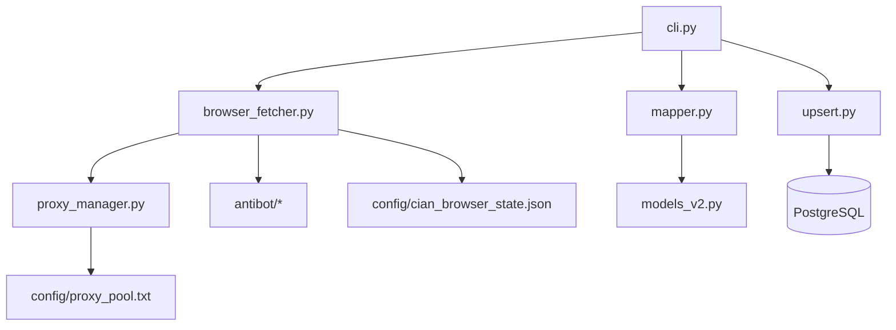

# Real Estate Parser - Project Map

> **Auto-generated:** 2025-11-03  
> **For:** GitHub SpecKit & Context7 indexing

## 📊 Project Statistics

- **Total Python files:** 45
- **Total Markdown docs:** 29
- **Lines of code:** ~8,000 (estimated)
- **Test coverage:** ~60% (to improve)
- **Active branches:** fix1 (dev), master (prod)

## 🗂️ Directory Structure

```
realestate/
├── 📁 .speckit/                    # SpecKit governance & planning
│   ├── constitution/               # Project principles & guidelines
│   ├── specifications/             # Feature specifications
│   ├── plans/                      # Implementation plans
│   ├── tasks/                      # Task tracking
│   ├── bugs/                       # Bug reports
│   └── ideas/                      # Future improvements
│
├── 📁 etl/                         # Extract-Transform-Load pipeline
│   ├── 📁 collector_cian/          # CIAN.ru specific scraper ⭐
│   │   ├── cli.py                  # 🚪 Entry point - CLI commands
│   │   ├── fetcher.py              # HTTP API fetcher (deprecated, 404s)
│   │   ├── browser_fetcher.py      # ⭐ Playwright HTML parser (main)
│   │   ├── mapper.py               # Data transformation & validation
│   │   ├── mapper_v2.py            # Alternative mapper (experimental)
│   │   ├── captcha_solver.py       # AntiCaptcha integration
│   │   ├── proxy_manager.py        # Proxy pool manager
│   │   └── 📁 payloads/            # Search query templates (YAML)
│   │       └── cheap_first.yaml    # Default: cheap listings in Moscow
│   │
│   ├── 📁 antibot/                 # Generic anti-bot toolkit
│   │   ├── behavior.py             # Human-like interaction patterns
│   │   ├── captcha.py              # CAPTCHA solver wrapper
│   │   ├── fingerprint.py          # Browser fingerprint spoofing
│   │   ├── proxy.py                # Proxy rotation logic
│   │   ├── retry.py                # Exponential backoff & circuit breaker
│   │   ├── session.py              # Session management
│   │   ├── storage.py              # Cookie/storage persistence
│   │   └── user_agent.py           # User-Agent pool
│   │
│   ├── 📁 product_scraper/         # Mass product scraping (future)
│   │   ├── cli.py                  # Worker CLI
│   │   ├── queue.py                # Postgres-based task queue
│   │   ├── worker.py               # Parallel worker implementation
│   │   └── fetcher.py              # Base fetcher class
│   │
│   ├── 📁 ai_evaluator/            # AI photo analysis (experimental)
│   │   ├── photo_analyzer.py       # Renovation quality detection
│   │   ├── batch_processor.py      # Batch processing pipeline
│   │   └── cost_optimizer.py       # API cost optimization
│   │
│   ├── models.py                   # Pydantic data models (legacy)
│   ├── models_v2.py                # Updated data models
│   ├── upsert.py                   # ⭐ Database persistence layer
│   └── flows.py                    # Prefect orchestration (WIP)
│
├── 📁 db/                          # Database schemas & migrations
│   ├── schema.sql                  # ⭐ Main schema (listings, prices)
│   ├── schema_products.sql         # Product scraping schema
│   └── migrations/                 # SQL migration scripts
│
├── 📁 tests/                       # Test suite
│   ├── conftest.py                 # Pytest fixtures
│   ├── test_mapper.py              # Parser/mapper tests
│   └── test_upsert.py              # Database integration tests
│
├── 📁 scripts/                     # One-off debugging scripts
│   ├── debug_html_selectors.py     # HTML structure analyzer
│   ├── test_antibot_cian.py        # Anti-bot strategy tester
│   └── test_production_filters.py  # Search query tester
│
├── 📁 config/                      # Runtime configuration
│   ├── proxy_pool.txt              # Active proxy list (NodeMaven)
│   ├── cian_browser_state.json     # Saved cookies & storage
│   └── refresh_proxies.py          # Proxy refresh script
│
├── 📁 docs/                        # Documentation
│   ├── product-scraping-roadmap.md
│   ├── antibot-audit.md
│   └── blueprint.md
│
├── 📁 web/                         # Web UI (experimental)
│   ├── app.py                      # Flask application
│   └── templates/                  # HTML templates
│
├── 📁 frontend/                    # Next.js frontend (WIP)
│   └── ...
│
├── 📁 api/                         # FastAPI backend (future)
│   └── main.py
│
├── .env                            # Environment variables (DB, API keys)
├── docker-compose.yml              # PostgreSQL + PostGIS stack
├── requirements.txt                # Python dependencies
├── README.md                       # ⭐ Main documentation
└── .context7.yaml                  # Context7 MCP configuration

```

## 🔑 Key Entry Points

### For AI Assistants
Start here to understand the codebase:

1. **[README.md](../README.md)** - Project overview & quick start
2. **[.speckit/constitution/project-constitution.md](.speckit/constitution/project-constitution.md)** - Principles & guidelines
3. **[etl/collector_cian/cli.py](../etl/collector_cian/cli.py)** - CLI interface (main entry)
4. **[etl/collector_cian/browser_fetcher.py](../etl/collector_cian/browser_fetcher.py)** - Core parsing logic
5. **[db/schema.sql](../db/schema.sql)** - Database schema

### For Developers
Common development tasks:

```bash
# Run scraper (basic)
python -m etl.collector_cian.cli to-db --pages 4

# Run scraper with detailed parsing
python -m etl.collector_cian.cli to-db --pages 4 --parse-details

# Run tests
pytest tests/

# Debug HTML selectors
python scripts/debug_html_selectors.py

# Check data quality
psql $PG_DSN -c "SELECT * FROM data_quality_metrics;"
```

## 🧩 Module Dependencies



## 📝 Current Focus Areas

### Active Development (as of 2025-11-03)
1. **Data completeness issues** - Fix OfferSubtitle parsing
2. **Automated scraping** - Setup daily cron/systemd timer
3. **Test coverage** - Add integration & E2E tests

### Known Issues
- See [.speckit/bugs/incomplete-data.md](.speckit/bugs/incomplete-data.md)
- CIAN HTTP API returns 404 (must use Playwright)
- Some listings missing address/rooms/area

### Upcoming Features
- See [.speckit/ideas/improvements-backlog.md](.speckit/ideas/improvements-backlog.md)
- Price drop alerts (Telegram)
- Metabase dashboards
- Multi-region support

## 🔗 External Integrations

### Active
- **NodeMaven Proxies** - Residential proxies (RU)
- **AntiCaptcha** - CAPTCHA solving
- **PostgreSQL** - Main data store
- **Playwright** - Browser automation

### Planned
- **Prefect** - Workflow orchestration
- **Metabase** - Analytics dashboards
- **Telegram Bot** - Price alerts

## 🎯 SpecKit Integration

### Constitution
- [project-constitution.md](.speckit/constitution/project-constitution.md)

### Active Tasks
- [current-sprint.md](.speckit/tasks/current-sprint.md)

### Open Bugs
- [incomplete-data.md](.speckit/bugs/incomplete-data.md)

### Ideas Backlog
- [improvements-backlog.md](.speckit/ideas/improvements-backlog.md)

---

**Maintained by:** AI Assistant  
**Last updated:** 2025-11-03  
**Contact:** GitHub Issues
