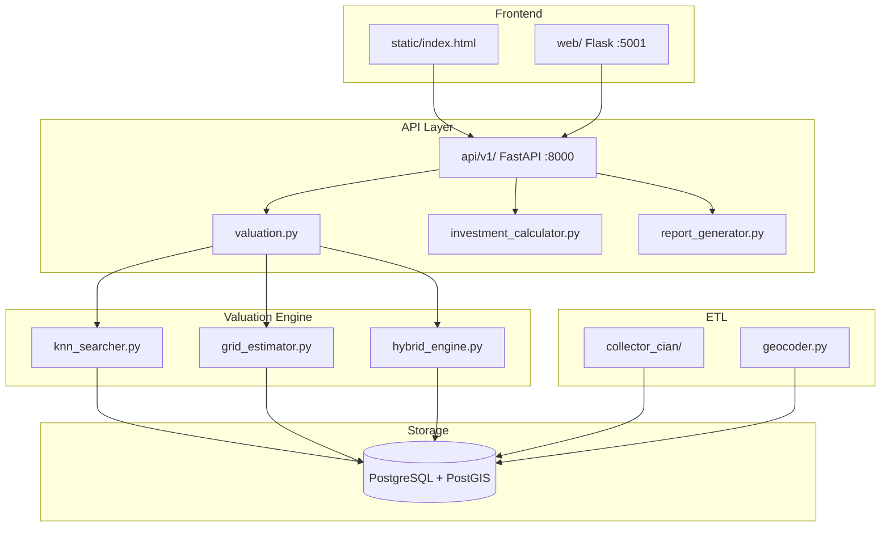

# Real Estate Valuation Platform - Project Map

> **Обновлено:** 2025-01-03
> **Версия:** 2.1.0

## Статистика проекта

| Метрика | Значение |
|---------|----------|
| Python файлов | ~110 |
| Строк кода | ~30,000 |
| Markdown документов | ~50 (после очистки) |
| Активная ветка | main |

---

## Структура директорий

```
realestate/
├── .speckit/                        # SpecKit документация
│   ├── constitution/                # Принципы проекта
│   ├── specifications/              # Спецификации фич
│   ├── tasks/                       # Трекинг задач
│   ├── bugs/                        # Баг-репорты
│   └── ideas/                       # Бэклог идей
│
├── api/                             # FastAPI Backend (порт 8000)
│   └── v1/
│       ├── valuation.py             # Оценка недвижимости (главный)
│       ├── investment_calculator.py # Инвестиционный калькулятор
│       ├── report_generator.py      # PDF отчёты
│       ├── html_report_generator.py # HTML отчёты
│       ├── claude_parser.py         # AI парсер данных
│       └── card_generator.py        # Генератор карточек
│
├── etl/                             # ETL Pipeline
│   ├── collector_cian/              # CIAN Парсер
│   │   ├── cli.py                   # CLI команды
│   │   ├── browser_fetcher.py       # Playwright парсер
│   │   ├── mapper.py                # Трансформация данных
│   │   ├── captcha_solver.py        # AntiCaptcha
│   │   ├── proxy_manager.py         # Прокси пул
│   │   └── payloads/                # Шаблоны запросов
│   │
│   ├── valuation/                   # Движок оценки
│   │   ├── knn_searcher.py          # KNN поиск аналогов
│   │   ├── grid_estimator.py        # Grid оценка
│   │   ├── hybrid_engine.py         # Гибридный алгоритм
│   │   ├── combined_engine.py       # Комбинированный движок
│   │   ├── rosreestr_searcher.py    # Данные Росреестра
│   │   └── models.py                # Модели данных
│   │
│   ├── antibot/                     # Anti-bot тулкит
│   │   ├── captcha.py               # CAPTCHA решатель
│   │   ├── proxy.py                 # Ротация прокси
│   │   ├── fingerprint.py           # Фингерпринт браузера
│   │   ├── retry.py                 # Circuit breaker
│   │   ├── storage.py               # Хранение cookies
│   │   └── user_agent.py            # User-Agent пул
│   │
│   ├── ai_evaluator/                # AI анализ фото
│   │   ├── photo_analyzer.py        # Качество ремонта
│   │   ├── batch_processor.py       # Пакетная обработка
│   │   └── cost_optimizer.py        # Оптимизация API
│   │
│   ├── models_v2.py                 # Pydantic модели
│   ├── upsert.py                    # Персистентность БД
│   ├── geocoder.py                  # DaData геокодинг
│   ├── address_parser.py            # Парсинг адресов
│   ├── district_matcher.py          # Сопоставление районов
│   ├── encumbrance_analyzer.py      # Анализ обременений
│   └── flows.py                     # Prefect оркестрация
│
├── web/                             # Flask Web (порт 5001)
│   ├── app.py                       # Flask entry point
│   ├── api.py                       # REST API
│   ├── api_map.py                   # API карты
│   ├── routes/
│   │   ├── listings.py              # Объявления
│   │   ├── local_valuation.py       # Локальная оценка
│   │   └── encumbrances.py          # Обременения
│   ├── templates/                   # Jinja2 шаблоны
│   └── static/                      # CSS, JS
│
├── static/                          # Статика (SPA)
│   └── index.html                   # Главный интерфейс
│
├── telegram_bot/                    # Telegram бот
│   ├── bot.py                       # Основная логика
│   ├── egrn_parser.py               # EGRN парсер
│   ├── smart_params.py              # Умные параметры
│   └── START_BOT.sh                 # Скрипт запуска
│
├── db/                              # База данных
│   ├── schema.sql                   # Основная схема
│   ├── schema_products.sql          # Продукты (для парсера)
│   └── migrations/                  # Миграции
│
├── scripts/                         # Утилиты
│   ├── estimate_price.py            # Оценка цены
│   ├── geocode_all_listings.py      # Пакетный геокодинг
│   ├── run_aggregation.py           # Агрегация данных
│   ├── normalize_fias.py            # FIAS нормализация
│   ├── alert_new_encumbrances.py    # Алерты обременений
│   └── test_*.py                    # Тестовые скрипты
│
├── tests/                           # Тесты
│   ├── conftest.py                  # Pytest фикстуры
│   ├── test_mapper.py               # Тесты парсера
│   ├── test_upsert.py               # Тесты БД
│   └── test_address_cleaning.py     # Тесты адресов
│
├── infra/                           # Инфраструктура
│   ├── nginx/                       # Nginx конфиги
│   ├── systemd/                     # Systemd сервисы
│   └── cloudflare/                  # Cloudflare
│
├── docs/                            # Документация
│   └── *.md                         # Разные гайды
│
├── deployment/                      # Файлы деплоя
│   └── *.service                    # Systemd юниты
│
├── config/                          # Runtime конфиг
│   ├── proxy_pool.txt               # Пул прокси
│   └── cian_browser_state.json      # Cookies браузера
│
├── .env                             # Переменные окружения
├── .env.example                     # Пример конфига
├── .context7.yaml                   # Context7 MCP конфиг
├── docker-compose.yml               # Docker stack
├── requirements.txt                 # Python зависимости
├── README.md                        # Главная документация
├── QUICKSTART.md                    # Быстрый старт
├── START.sh                         # Запуск API
└── web_viewer.py                    # Запуск Web UI
```

---

## Ключевые точки входа

### Для разработчиков

| Файл | Описание |
|------|----------|
| `api/v1/valuation.py` | Главный API оценки |
| `etl/valuation/hybrid_engine.py` | Гибридный алгоритм |
| `etl/valuation/knn_searcher.py` | KNN поиск аналогов |
| `api/v1/investment_calculator.py` | Инвест. калькулятор |
| `static/index.html` | SPA интерфейс |
| `telegram_bot/bot.py` | Telegram бот |

### Команды запуска

```bash
# API сервер (FastAPI :8000)
bash START.sh

# Web интерфейс (Flask :5001)
python web_viewer.py

# CIAN парсер
python -m etl.collector_cian.cli pull --pages 5

# Telegram бот
cd telegram_bot && bash START_BOT.sh

# Тесты
pytest tests/
```

---

## Архитектура системы



---

## Алгоритм оценки (BOTTOM-3)

### Параметры (актуальные)

| Параметр | Значение | Файл |
|----------|----------|------|
| `AREA_ADJUSTMENT_COEF` | 0.001 | knn_searcher.py:228 |
| `AGING_DISCOUNT_PER_30_DAYS` | 0.01 | knn_searcher.py:235 |
| `LAST_FLOOR_DISCOUNT` | 0.02 | static/index.html:3171 |
| `FIRST_FLOOR_DISCOUNT` | 0.05 | static/index.html:3170 |
| `BARGAIN_DISCOUNT` | 0.07 | valuation.py |
| `IQR_MULTIPLIER` | 1.5 | hybrid_engine.py:60 |

### Confidence → Price Range

| Confidence | Range |
|------------|-------|
| ≥70% | ±5% |
| 50-69% | ±10% |
| <50% | ±15% |

---

## Внешние интеграции

### Активные

| Сервис | Назначение | Конфигурация |
|--------|------------|--------------|
| PostgreSQL + PostGIS | Хранение | docker-compose.yml |
| DaData | Геокодинг | DADATA_API_KEY |
| NodeMaven | Прокси (RU) | NODEMAVEN_PROXY_URL |
| BrightData | Прокси (DC) | BRIGHTDATA_PROXY_URL |
| AntiCaptcha | CAPTCHA | ANTICAPTCHA_KEY |
| Playwright | Браузер | pip install |
| Telegram | Бот | TELEGRAM_BOT_TOKEN |

---

## API Endpoints

### Valuation API (FastAPI :8000)

| Endpoint | Method | Описание |
|----------|--------|----------|
| `/estimate` | POST | Оценка объекта |
| `/estimate/comparables` | POST | Получить аналоги |
| `/investment/calculate` | POST | Инвест. расчёт |
| `/report/generate` | POST | PDF отчёт |
| `/health` | GET | Health check |

### Web API (Flask :5001)

| Endpoint | Method | Описание |
|----------|--------|----------|
| `/` | GET | SPA интерфейс |
| `/api/valuations/history` | GET | История оценок |
| `/api/map/clusters` | GET | Кластеры карты |
| `/api/listings` | GET | Объявления |

---

## Недавние изменения (Январь 2025)

### Исправленные баги

| Баг | Файл | Строка |
|-----|------|--------|
| ЖКУ всегда включались (`or True`) | investment_calculator.py | 150 |
| Координаты 0.0 = invalid | valuation.py | 311 |
| Area correction sign mismatch | rosreestr_searcher.py | 270-275 |

### Новые функции

- **IQR фильтрация** выбросов в hybrid_engine.py
- **Aging discount** -1% за 30 дней в knn_searcher.py
- **Confidence-based range** в hybrid_engine.py
- **Кнопка "Переоценить"** в истории оценок
- **Дисконт последнего этажа** снижен с 5% до 2%

---

## SpecKit интеграция

### Файлы

| Путь | Содержимое |
|------|------------|
| constitution/project-constitution.md | Принципы проекта |
| specifications/knn-valuation-system.md | Спецификация оценки |
| tasks/current-sprint.md | Текущие задачи |
| bugs/ | Баг-репорты |
| ideas/improvements-backlog.md | Бэклог улучшений |

### Использование

```bash
# В AI чате
/speckit.constitution    # Принципы
/speckit.tasks           # Задачи
/speckit.bugs            # Баги
/speckit.ideas           # Идеи
```

---

## Context7 MCP

Конфигурация: `.context7.yaml`

### Topic Mapping

| Тема | Файлы |
|------|-------|
| valuation | api/v1/valuation.py, etl/valuation/* |
| investment | api/v1/investment_calculator.py |
| parsing | etl/collector_cian/* |
| telegram | telegram_bot/* |
| bugs | .speckit/bugs/ |

---

**Поддержка:** GitHub Issues
**Последнее обновление:** 2025-01-03
